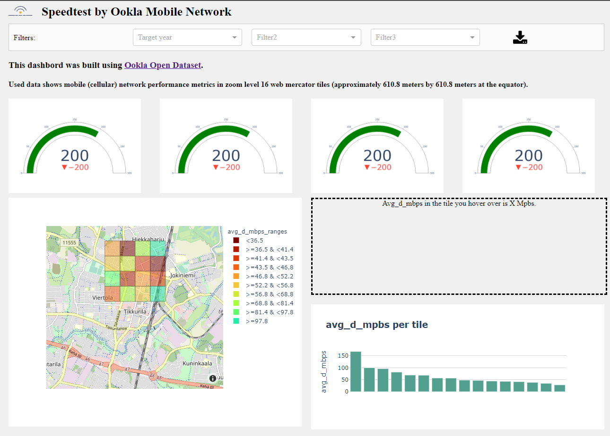

# Ookla_map

This code is for a dashboard that shows average downlink speeds in Finland using [Ookla open data set](https://www.speedtest.net/insights/blog/announcing-ookla-open-datasets).

Ookla data set is available via the [Registry of Open Data on AWS](https://registry.opendata.aws/speedtest-global-performance/) in Apache Parquet and Shapefile formats. The data is to be used under the [Creative Commons license for non-commercial use](https://creativecommons.org/licenses/by-nc-sa/4.0/) license.

Ookla's technical documentation and tutorials are available on [GitHub](https://github.com/teamookla/ookla-open-data).
[Here](https://github.com/teamookla/ookla-open-data/blob/master/tutorials/aggregate_by_county_py.ipynb) is a tutorial for analyzing download speeds in Kentucky counties using Python.

Project Organization
------------

    ├── Data
    │   ├── OrigOoklaData             <- Ookla open data source for the entire world.
    │                                   The data is not being stored here.
    │   ├── FinlandData               <- Filtered data for Finland (Uusimaa, Vantaa).
    │
    ├── app2.ipyb                     <- Jupyter notebook with the code.                 
    │    
    ├── environment.yml               <- Required libraries for the environment.
    │                                    Geopandas lib and its dependencies are to be installed via conda environment,
    │                                    not via pip install. Make to sure to remove or change the
    │                                    last row of this file: "prefix: C:\Users\OmniAvo\.conda\envs\mapenv".
    │
    ├── app2.py                       <- Main code for use in this project (same as in Jupyter
    │                                   notebook file app2.ipyb).
    │            
    ├── README.md                     <- The top-level README file.
    │                
    └── requirements.txt              <- The requirements file for reproducing the analysis
                                        environment in addition to environment.yml.

